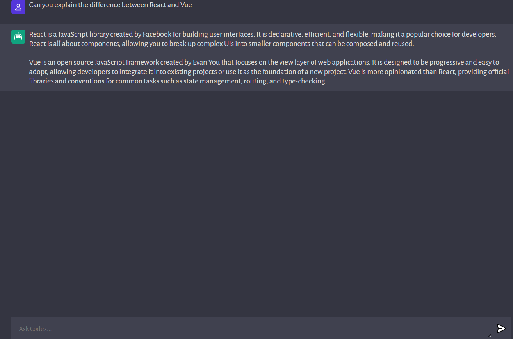

# Fun With Open AI's API

## Description

This project uses the OpenAI API to create a chatbot geared toward answering coding questions. It was developed using Vite, Render, and Vercel as well as the Open AI API. The link to the deployed site is below:

https://fun-with-ai-js.vercel.app/

## Installation

N/A

## Usage

This site makes calls from the OpenAI API and will allow the user to interact with the AI, ask questions, and receive a natural conversational reply.

## Credits

Jenn Marshall, 2023 following a tutorial from JavaScript Mastery from Youtube.com.

## License

Please refer to the license in the repo.
